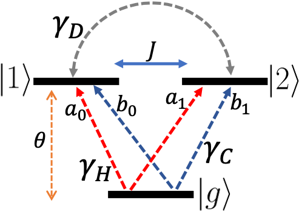

# Fully differentiable optimization protocols for non-equilibrium steady states
**authors:** Rodrigo A. Vargas-Hernandez, Ricky T. Q. Chen, Kenneth A. Jung, and Paul Brumer

---------------------------------------
**GOAL:**

Optimizing quantum non-equilibrium steady state systems using gradient-based methods power by automatic differentiation.

[arxiv paper](https://arxiv.org/pdf/2103.12604.pdf)

---------------------------------------
Diagram of the methodology proposed here.

For a V-system, 

We maximize the transport of energy to the reaction center (RC) using gradient descent,

<!----->

All simulations were carried in [JAX](jax.readthedocs.io/). We implemented the vector-Jacobian product to differentiate the steady state to incorporate it in the framework of automatic differentiation. 
For more details about our work we created a [Google Collab](energy_transfer.ipynb), where we better exaplain the details of our work. 

---------------------------------------
**other systems**: 
We also optimized a three level quantum heat transfer model using gradient based methods. For more details, check our [arxiv paper](https://arxiv.org/pdf/2103.12604.pdf). 

---------------------------------------
**Prerequisites**:
[JAX](jax.readthedocs.io/)
